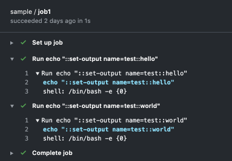
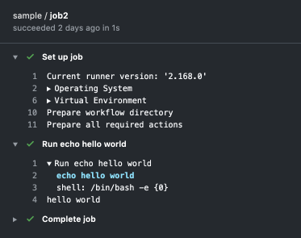

## code block
### back quote

`hoge fuga`

### multiline code block

```typescript
type HogeProps = <ComponentProps<typeof Hoge>>
type PartialP2 = Partial<Pick<HogeProps, 'p2'>>
type Props = HogeProps & PartialP2
```

## image

- image1



- image2



- via http


## title3

## title4

<!-- textlint-disable ja-technical-writing/ja-no-weak-phrase -->
まるだと思います
<!-- textlint-enable ja-technical-writing/ja-no-weak-phrase -->

おわり
